# Binary Tree / Pane Handling Architecture Documentation

This document provides an in-depth analysis of the binary tree and pane handling system in the Dumber browser application, based on thorough examination of the actual codebase.

## Table of Contents

1. [Overall Architecture](#overall-architecture)
2. [Core Data Structures](#core-data-structures)
3. [Component Hierarchy](#component-hierarchy)
4. [Binary Tree Operations](#binary-tree-operations)
5. [Widget Layer Integration](#widget-layer-integration)
6. [Focus Management System](#focus-management-system)
7. [Safety and Validation Systems](#safety-and-validation-systems)
8. [Operation Flow Diagrams](#operation-flow-diagrams)

## Overall Architecture

The pane handling system implements a sophisticated binary tree structure for managing browser panes (similar to tmux/Zellij), with multiple layers of abstraction and safety systems.

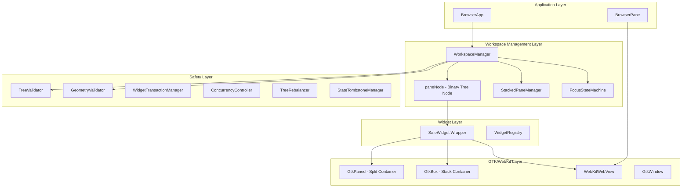

## Core Data Structures

### paneNode Structure

The `paneNode` is the fundamental building block of the binary tree:

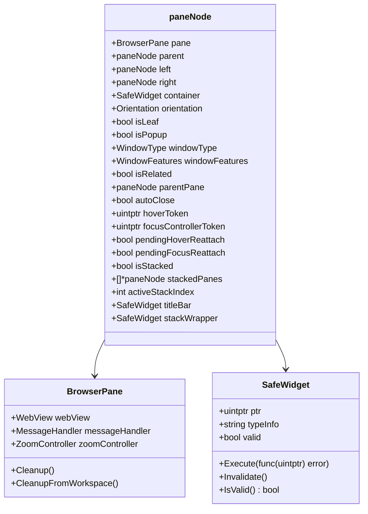

### WorkspaceManager Structure

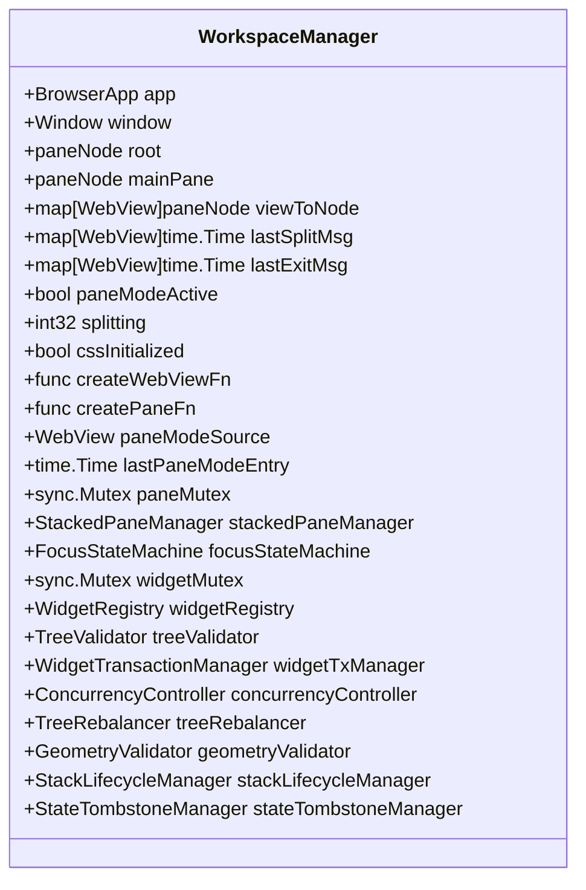

## Component Hierarchy

The system follows a clear hierarchical structure:

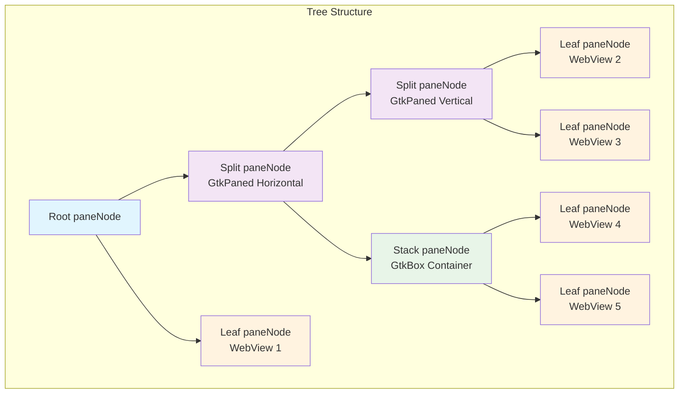

## Binary Tree Operations

### Split Operation Flow

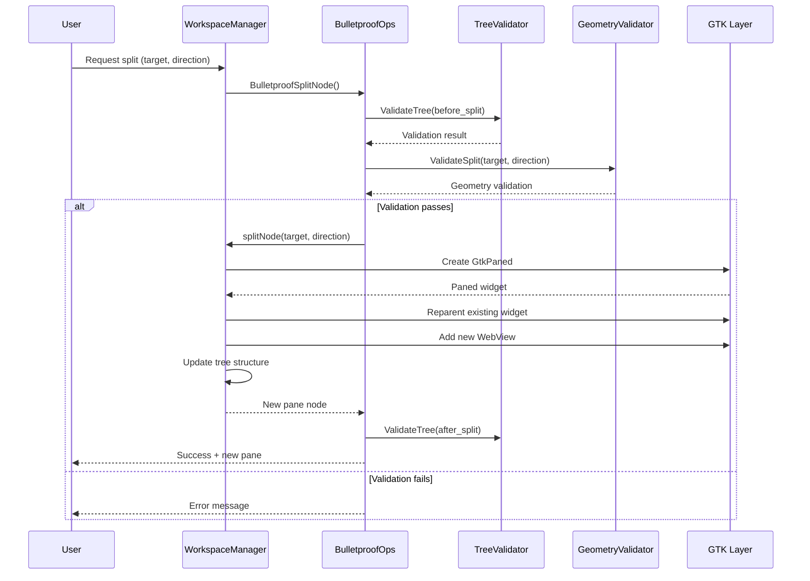

### Close Operation Flow

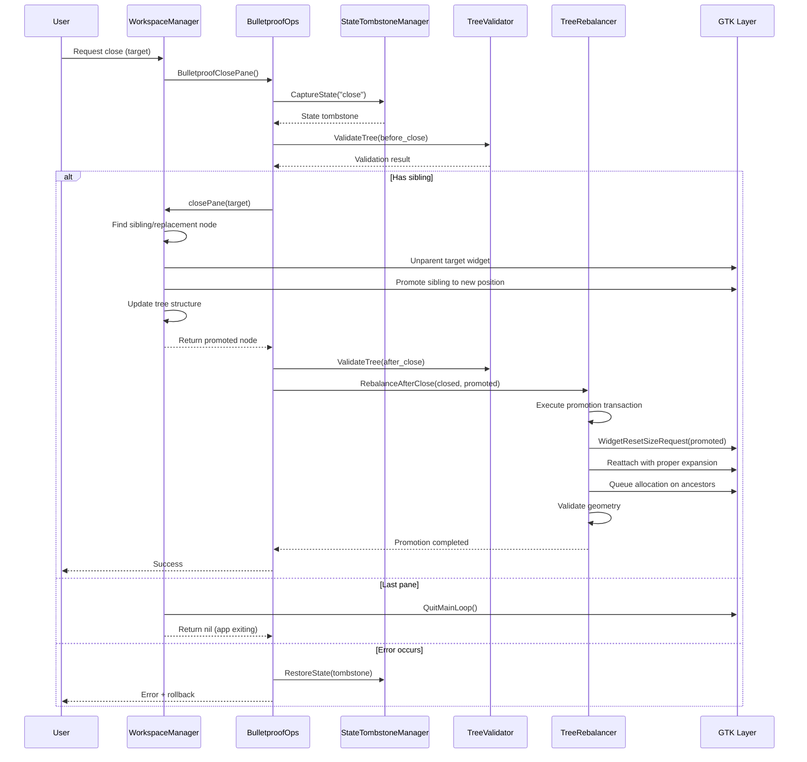

### Stack Operation

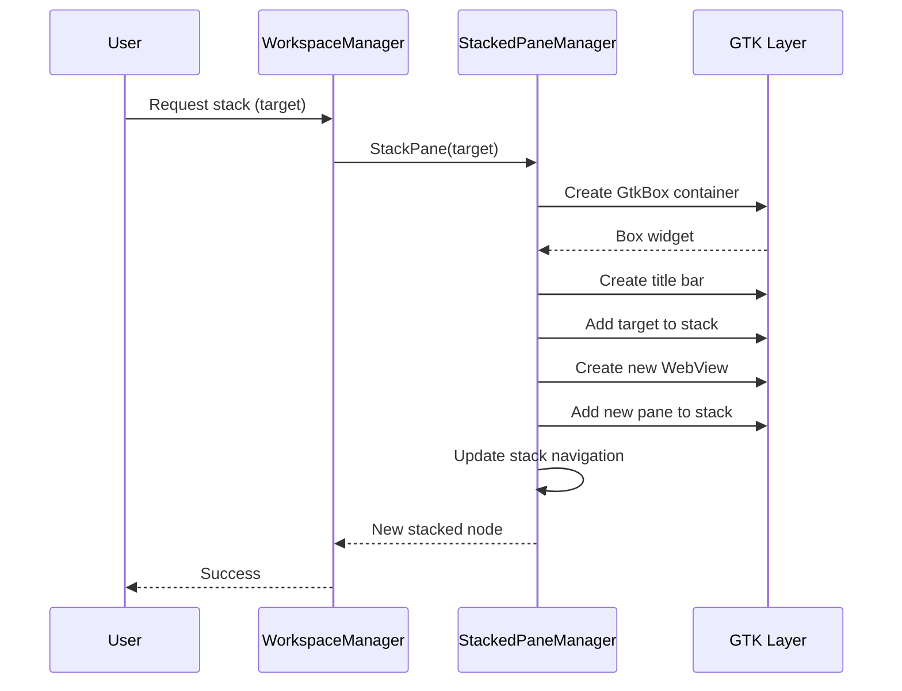

## Widget Layer Integration

### SafeWidget Architecture

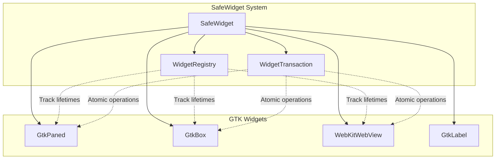

### Widget Lifecycle Management

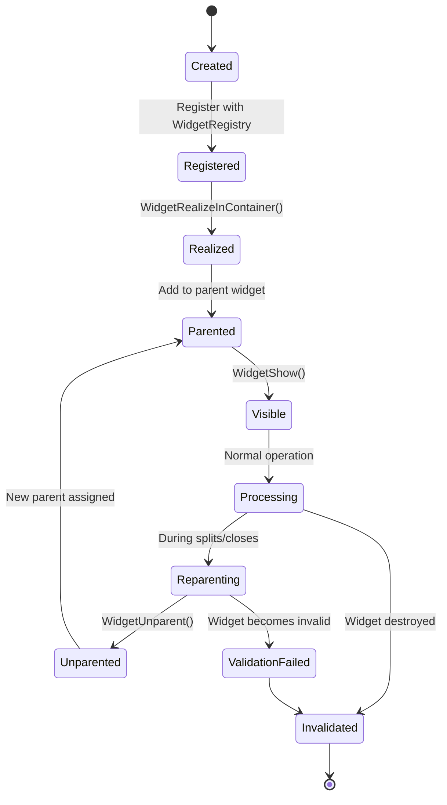

## Focus Management System

### Focus State Machine

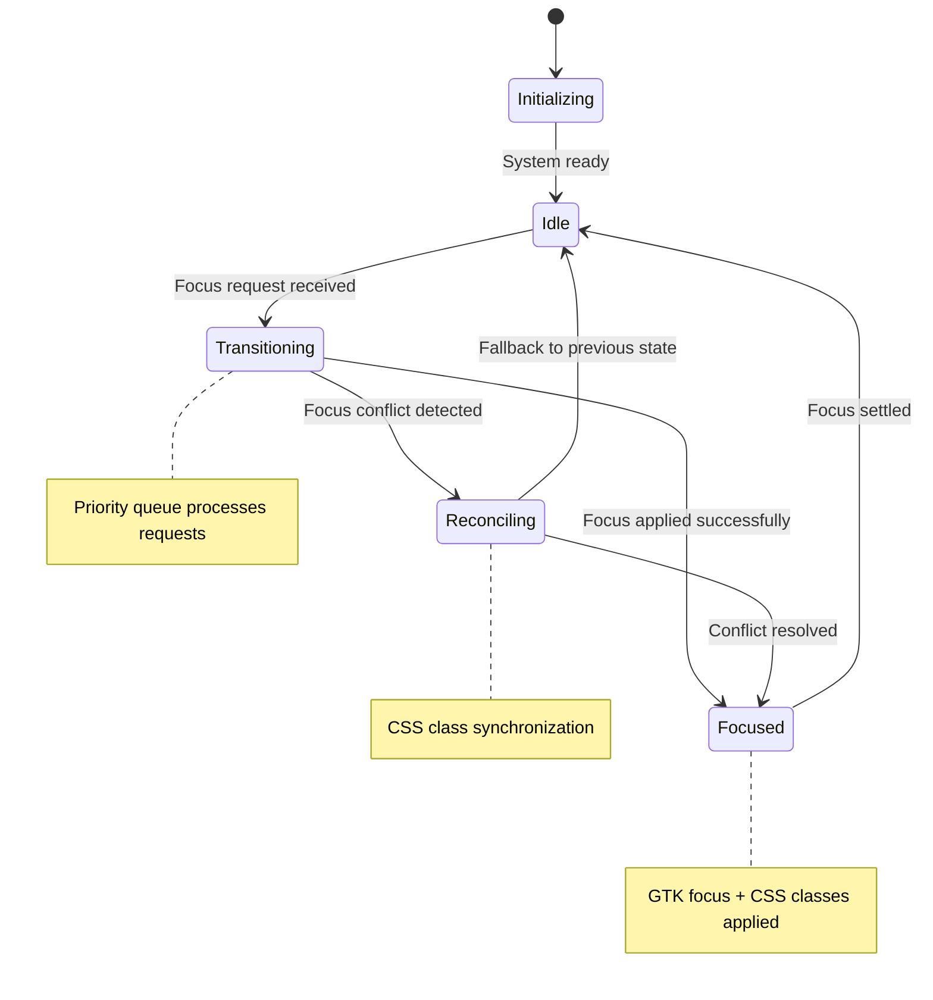

### Focus Request Processing

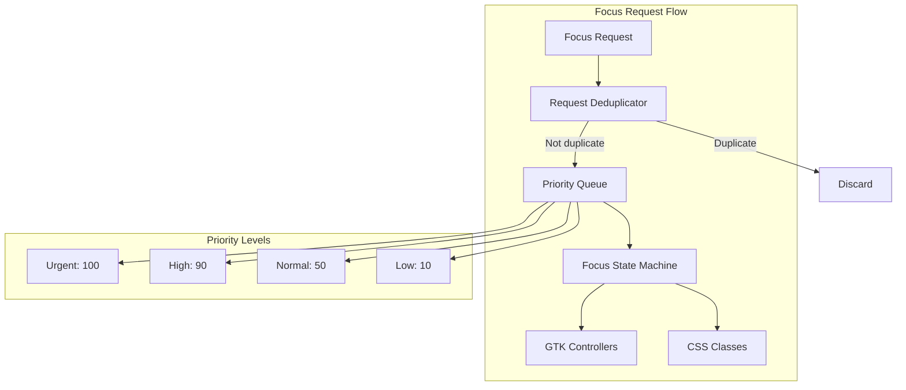

## Safety and Validation Systems

### Tree Validation

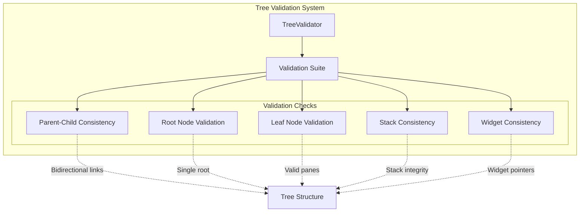

### Bulletproof Operation Wrapper

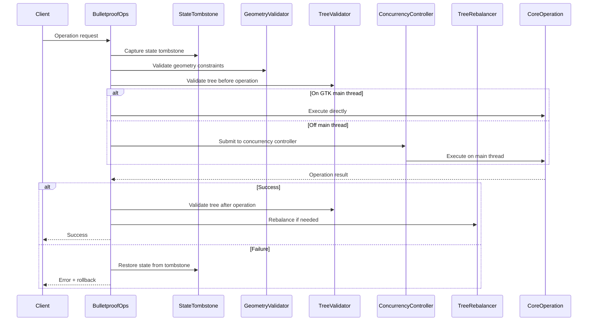

## Operation Flow Diagrams

### Complete Split Operation

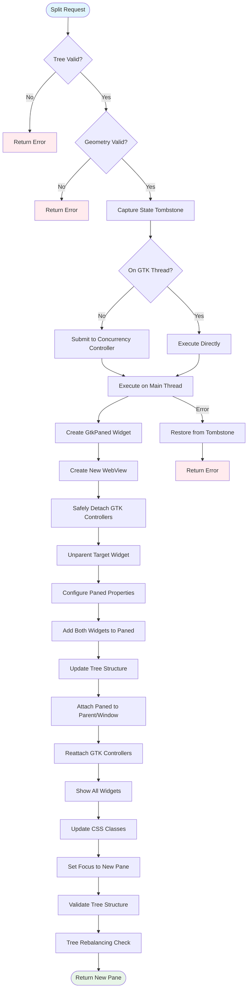

### Complete Close Operation

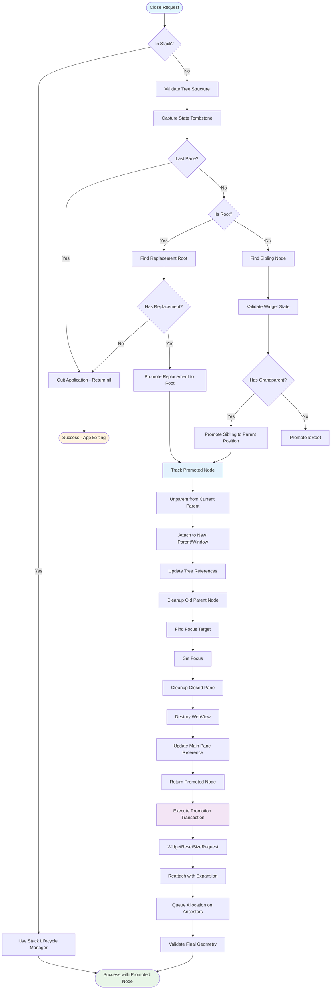

## CSS Class Management

The system uses CSS classes for visual feedback and state indication:

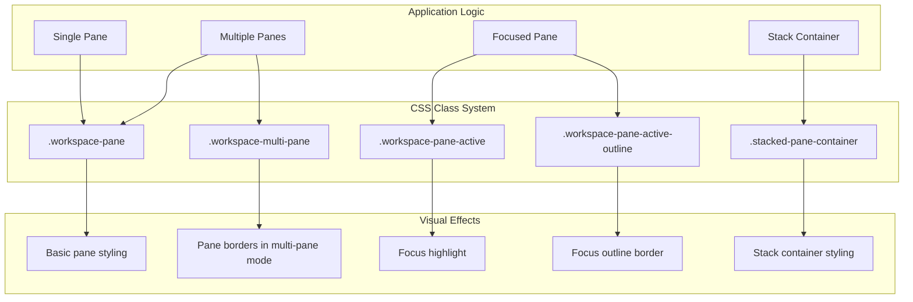

## Enhanced Promotion System

The system now includes a sophisticated promotion transaction system that ensures proper widget layout after pane closures:

### Promotion Transaction Flow

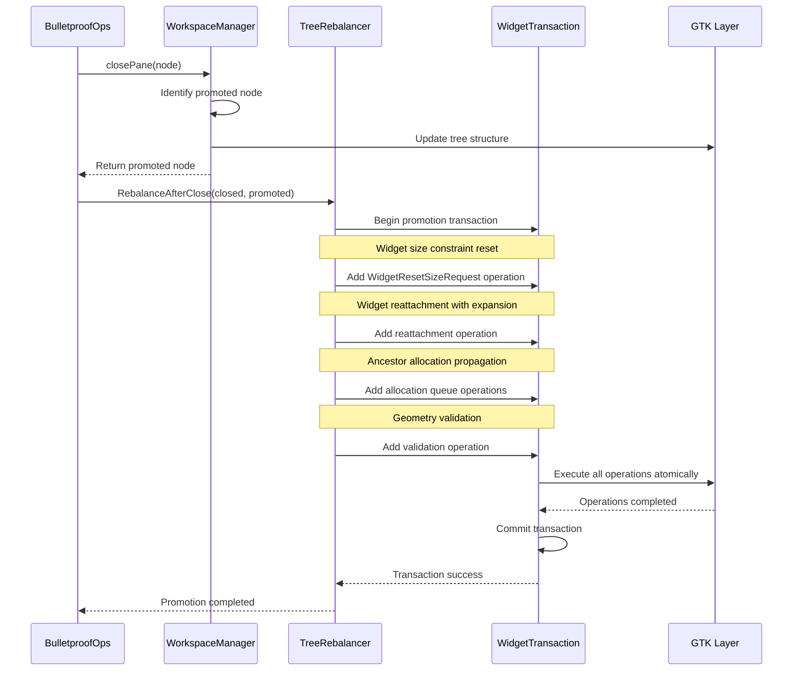

### Key Promotion Features

- **Size Constraint Reset**: `WidgetResetSizeRequest()` clears stale size constraints
- **Proper Expansion**: Ensures promoted widgets can expand to fill available space
- **Ancestor Propagation**: Queues allocation updates up the widget hierarchy
- **Geometry Validation**: Validates final widget bounds after promotion
- **Transaction Safety**: All operations are atomic with rollback capability

## Key Files and Their Responsibilities

| File | Purpose | Key Components |
|------|---------|----------------|
| `workspace_types.go:8` | Core data structures | `paneNode`, CSS constants |
| `workspace_manager.go:18` | Main coordinator | `WorkspaceManager`, initialization |
| `workspace_pane_ops.go:707` | Tree operations | Split, close, stack operations with promoted node tracking |
| `workspace_tree_rebalancer.go:92` | Tree balancing | Rebalancing algorithms, promotion transactions |
| `workspace_bulletproof_operations.go:158` | Safety wrapper | Bulletproof operation wrappers with promotion handling |
| `workspace_concurrency.go:454` | Async operations | Concurrency controller with promoted node results |
| `focus_state_machine.go:186` | Focus management | State machine, priority queue |
| `workspace_widgets_cgo.go:633` | GTK integration | Widget operations, WidgetResetSizeRequest |

## Performance Characteristics

- **Tree Height**: O(log n) for balanced trees, O(n) worst case
- **Split Operation**: O(log n) average case with rebalancing
- **Close Operation**: O(1) tree updates + O(k) widget operations where k = ancestor depth
- **Focus Changes**: O(1) with priority queue and deduplication
- **Widget Operations**: Atomic transactions prevent partial state
- **Promotion Transactions**: Batched GTK operations minimize UI thread overhead
- **Memory Usage**: Each pane node ~200 bytes + GTK widget overhead

### Recent Performance Improvements

- **Promoted Node Tracking**: Eliminates redundant tree traversals during rebalancing
- **Batched Widget Operations**: Ancestor allocation updates processed in single transaction
- **Size Constraint Management**: Explicit constraint reset prevents GTK layout conflicts
- **Async Consistency**: Identical behavior between sync and async operation paths

## Thread Safety

The system implements comprehensive thread safety:

- **Widget Operations**: All GTK operations marshaled to main thread
- **Focus Management**: Queue-based serialization with priority
- **State Changes**: Mutex protection for critical sections
- **Tree Modifications**: Atomic operations with rollback capability

This architecture provides a robust, efficient, and safe pane management system that can handle complex window layouts while maintaining excellent performance and user experience.